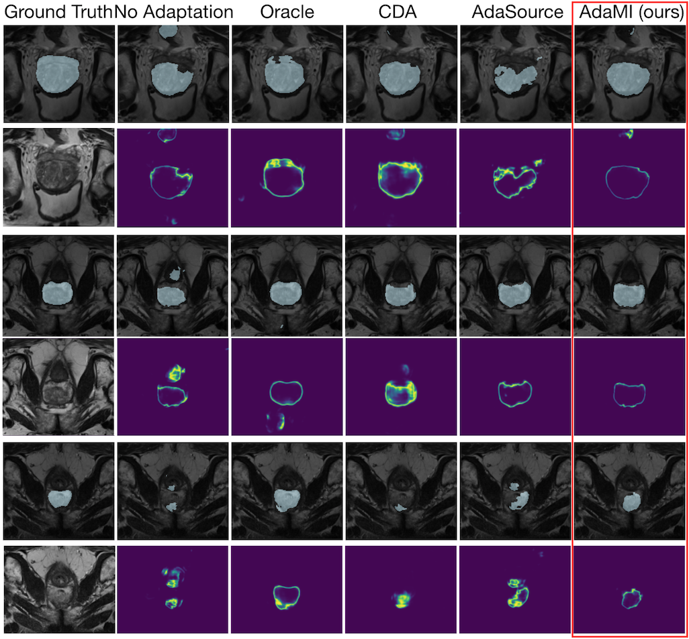

# SFDA
Source-Free Domain Adaptation for Image Segmentation
by [Mathilde Bateson](https://github.com/mathilde-b), [Hoel Kervadec](https://github.com/HKervadec), [Jose Dolz](https://github.com/josedolz), Hervé Lombaert, Ismail Ben Ayed @ETS Montréal

Code of our submission at [MICCAI 2020](https://link.springer.com/chapter/10.1007/978-3-030-59710-8_48) and its ongoing journal extension. Video of the MICCAI talk is available: 
https://www.youtube.com/watch?v=ALYaa5xrxbQ&ab_channel=MB

* [MICCAI 2020 Proceedings](https://link.springer.com/chapter/10.1007/978-3-030-59710-8_48)
* [arXiv preprint](https://arxiv.org/abs/2005.03697)

Please cite our paper if you find it useful for your research.

```

@inproceedings{BatesonSRDA,
	Author = {Bateson, Mathilde and Kervadec, Hoel and Dolz, Jose and Lombaert, Herv{\'e} and Ben Ayed, Ismail},
	Booktitle = {Medical Image Computing and Computer Assisted Intervention -- MICCAI 2020},
	Pages = {490--499},
	Publisher = {Springer International Publishing},
	Title = {Source-Relaxed Domain Adaptation for Image Segmentation},
	Year = {2020}
    Address = {Cham}}

```




## Requirements
Non-exhaustive list:
* python3.6+
* Pytorch 1.0
* nibabel
* Scipy
* NumPy
* Matplotlib
* Scikit-image
* zsh

## Data scheme
### datasets
For instance
```
prostate/
    train/
        img/
            Case_10_0.png
            ...
        gt/
            Case_10_0.png
            ...
        ...
    val/
        img/
            Case_11_0.png
            ...
        gt/
            Case_11_0.png
            ...
        ...
```
The network takes png or nii files as an input. The gt folder contains gray-scale images of the ground-truth, where the gray-scale level is the number of the class.

### Class-ratio (sizes) prior
The class-ratio prior is estimated from anatomical knowledge for each application. In our implementation, is it estimated for each slice in the target domain training and validation sets. It estimated once, before the start of the adaptation phase, and saved in a csv file. 

Scheme
```
sizes/
    prostate_sa.csv
    whs.csv
    ivd.csv
```
The size csv file should be as follow:

| val_ids | dumbpredwtags
| ------------- | ------------- |
| Case00_0.nii | [Estimated_Size_class0, Estimated_Size_class1, ..., Estimated_Size_classk]

Sample from sizes/prostate_sa.csv :

| val_ids  | val_gt_size | dumbpredwtags
| ------------- | ------------- |------------- |
| Case00_0.nii  | [147398.0, 827.0]  | [140225, 6905]
| Case00_1.nii  | [147080.0, 1145.0]  | [140225, 6905]
| Case00_14.nii  | [148225.0, 0.0] | [148225, 0]

Note that the true val_gt_size is unknown, so it is not directly used in our proposed SFDA. However, in our framework an image-level annotation is available for the target training dataset: the "Tag" of each class k, such that Estimated_Size_classk=0 if val_gt_size_k = 0

Note that in our implementation, the csv file has the size in pixels, and the KL Divergence loss divides by size/(w*h) to obtain the class-ratio.

### results
```
results/
    prostate/
        fs/
            best_epoch_3d/
                val/
                    Case_11_0.png
                    ...
            iter000/
                val/
            ...
        sfda/
            ...
        best.pkl # best model saved
        metrics.csv # metrics over time, csv
        best_epoch.txt # number of the best epoch
        val_dice.npy # log of all the metric over time for each image and class
        val_dice.png # Plot over time
        ...
    whs/
        ...
archives/
    $(REPO)-$(DATE)-$(HASH)-$(HOSTNAME)-sfda.tar.gz
    $(REPO)-$(DATE)-$(HASH)-$(HOSTNAME)-prostate.tar.gz
```
## Interesting bits
The losses are defined in the [`losses.py`](losses.py) file. 

## Cool tricks
Remove all assertions from the code. Usually done after making sure it does not crash for one complete epoch:
```
make -f sa.make <anything really> CFLAGS=-O
```

Use a specific python executable:
```
make -f sa.make <super target> CC=/path/to/the/executable
```

Train for only 5 epochs, with a dummy network, and only 10 images per data loader. Useful for debugging:
```
make -f sa.make <anything really> NET=Dimwit EPC=5 DEBUG=--debug
```

Rebuild everything even if already exist:
```
make -f sa.make <a> -B
```

Only print the commands that will be run (useful to check recipes are properly defined):
```
make -f sa.make <a> -n
```

## Related Implementation and Dataset
* [Mathilde Bateson](https://github.com/mathilde-b), [Hoel Kervadec](https://github.com/HKervadec), [Jose Dolz](https://github.com/josedolz), Hervé Lombaert, Ismail Ben Ayed. Constrained Domain Adaptation for Image Segmentation. In IEEE Transactions on Medical Imaging, 2021. [[paper]](https://ieeexplore.ieee.org/document/9382339) [[implementation]](https://github.com/mathilde-b/CDA) 
* [Hoel Kervadec](https://github.com/HKervadec), [Jose Dolz](https://github.com/josedolz), Meng Tang, Eric Granger, Yuri Boykov, Ismail Ben Ayed. Constrained-CNN losses for weakly supervised segmentation. In Medical Image Analysis, 2019. [[paper]](https://www.sciencedirect.com/science/article/pii/S1361841518306145?via%3Dihub) [[code]](https://github.com/LIVIAETS/SizeLoss_WSS)
* Prostate Dataset and details: https://raw.githubusercontent.com/liuquande/SAML/
* Heart Dataset and details: https://github.com/carrenD/Medical-Cross-Modality-Domain-Adaptation
* Spine Dataset and details: https://ivdm3seg.weebly.com/ 


## Note
The model and code are available for non-commercial research purposes only.
